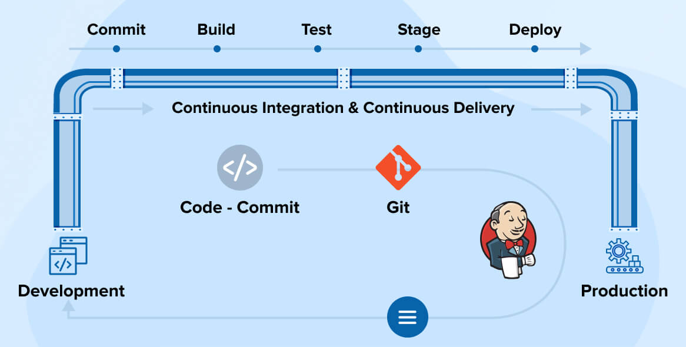

## 🚀 AWS EKS | Terraform | Jenkins CI/CD | ArgoCD GitOps — End-to-End DevOps Project

### This repository contains a fully automated production-ready DevOps setup built using:

* Infrastructure as Code (Terraform)

* Containerization (Docker)

* Kubernetes on AWS EKS

* CI/CD pipelines using Jenkins

* GitOps deployment using ArgoCD

* Microservices deployment (Cart, Catalogue, User, Payment, Shipping, Frontend)

* It simulates a real e-commerce platform (Roboshop) and demonstrates how modern teams deploy & manage cloud applications end-to-end.
 

## 🏗️ Tech Stack

| Component         | Tool                              |
| ----------------- | --------------------------------- |
| Cloud             | AWS (EKS, EC2, VPC, IAM, ECR, S3) |
| IaC               | Terraform                         |
| Automation        | Shell Scripting                   |
| Config Management | Ansible                           |
| Containerization  | Docker                            |
| Orchestration     | Kubernetes                        |
| CI/CD             | Jenkins                           |
| GitOps            | ArgoCD                            |
| Repo              | GitHub                            |


## This project implements:

AWS EKS Cluster

VPC, Subnets, NAT Gateway, Security Groups

ECR for container images

Terraform for entire infra provisioning

Jenkins pipelines for CI & ECR push

ArgoCD for GitOps-based deployment to EKS

Microservices deployed as Kubernetes manifests

## 🏗️ Project Structure
```md
aws-eks-iac-cicd-gitops-project/
│── terraform-aws-eks/                       # Complete AWS Infrastructure (VPC, EKS, IAM)
│── terraform-jenkins-agent-setup/           # Jenkins agent setup using Terraform
│── cart-ci/                                 # Jenkins CI pipeline for Cart microservice
│── catalogue-ci/
│── user-ci/
│── payment-ci/
│── shipping-ci/
│── frontend-ci/
│── user-cd/                                  # ArgoCD Kubernetes manifests
│── cart-shipping-payment-frontend-ArgoCD/
│── jenkins-shared-library/                  # Reusable CI functions
```


## ⚙️ Infrastructure (IaC) – Terraform

### Provisioned Using Terraform:

VPC, Subnets, Route Tables

Internet & NAT Gateways

EKS Cluster + Node Groups

ECR Repositories

IAM Roles & Policies

Jenkins agent setup (EC2)


## Commands to deploy:
```md
terraform init
terraform apply -auto-approve
```

 ## 🛠️ CI/CD With Jenkins

### Each microservice has its own Jenkins pipeline:

✔ Builds Docker image
✔ Tags image with version
✔ Pushes to AWS ECR
✔ Updates ArgoCD manifests repo (GitOps flow)

Shared Library

Reusable Groovy functions stored in:
```
jenkins-shared-library/vars/
```
🚀 GitOps With ArgoCD (CD Layer)

ArgoCD pulls Kubernetes manifests from this repo and deploys to EKS automatically.

## Flow:

1️⃣ Developer pushes code
2️⃣ Jenkins builds & pushes image
3️⃣ Jenkins updates manifest image: <new-tag>
4️⃣ ArgoCD detects Git change
5️⃣ ArgoCD syncs & deploys new version to EKS

Zero manual deployment. Pure GitOps.

## 📦 Microservices Included

| Service       | Description                   |
| ------------- | ----------------------------- |
| **Catalogue** | Product listing backend       |
| **Cart**      | User shopping cart            |
| **User**      | Authentication service        |
| **Payment**   | Payment processing simulation |
| **Shipping**  | Shipment calculation backend  |
| **Frontend**  | UI for the entire store       |


## 📁 Folder-by-Folder Explanation
terraform-aws-eks/

Complete AWS infrastructure (network + EKS).

_*-ci/ (cart-ci, catalogue-ci, user-ci, etc.)

Jenkins pipelines for each microservice.

user-cd/, cart-shipping-payment-frontend-ArgoCD/

ArgoCD application definitions + K8s manifests.

jenkins-shared-library/

Centralized Groovy library for all pipelines.

▶️ How to Run the Entire Project
1️⃣ Create AWS infrastructure

* cd terraform-aws-eks
* terraform apply

2️⃣ Install Jenkins + ArgoCD

Follow outputs from Terraform.

3️⃣ Run CI pipeline for any service

This builds & pushes Docker image.

4️⃣ ArgoCD automatically deploys to EKS

GitOps ensures automatic sync.

## 🎯 Outcomes of This Project

### You demonstrate:

🔥 AWS Infrastructure (VPC, EKS, IAM)
🔥 Strong Terraform IaC skills
🔥 Production-grade CI/CD pipelines
🔥 Microservices & Dockerization
🔥 GitOps with ArgoCD
🔥 Kubernetes deployment expertise
🔥 Jenkins Shared Library usage

This is a full real-world DevOps skillset in one repo.

## 📞 Contact

* Mukhtar Buddabai Gari
* Aspiring DevOps Engineer
```
📧 mukhtarsheikhh05@gmail.com

🔗 GitHub: https://github.com/sheikh-mukhtar

🔗 LinkedIn: https://linkedin.com/in/mukhtarsheikh
```